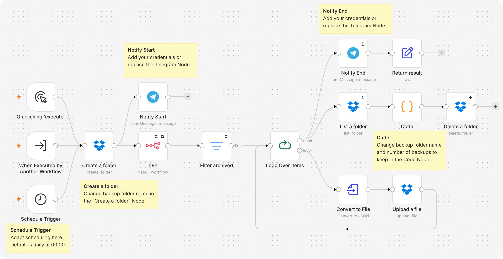

# n8n-backup-dropbox
Backup your n8n Workflows to a Dropbox folder



## Install
Import the workflow JSON into n8n.

## Configure Nodes
### Schedule trigger Node
Adapt the scheduling. Default is daily at 00:00
### Create a folder Node
Adpapt backup folder name
### Code in JavaScript Node
Adapt the first 2 lines:
```js
const KEEP = 10;  // Number of folders to keep
const FOLDER = "backup";  // Backup folder
```
### Notify Nodes
Add your Telegram credentials and chat_id

## How it works
All workflows are exported to a time stamped subfolder of the backup-folder.
If the number of folders to keep is reached, the oldest folder is deleted.

Star me, if you like it :-)

**[More n8n Stuff here](https://marketmix.com/de/tag/n8n/)**
